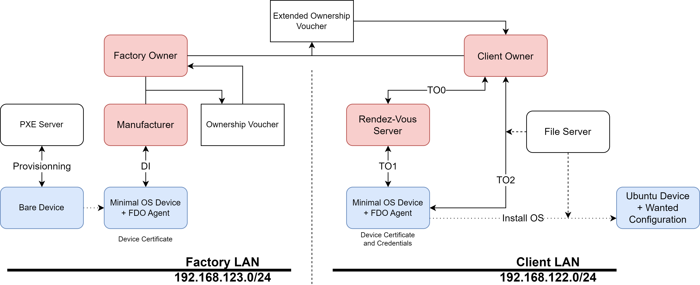

A repository backing up a FDO Demo i made in june/july 2022 at my work
Further documentation can be found in the [Wiki](https://github.com/yannou38/FDO-demo/wiki)

## What is FDO ?
FDO (FIDO Device Onboarding) is an onboarding protocol for IoT device that aim to do a late-binding of ressources.

It recognize a few roles in the protocol:
- The device
- The Manufacturer
- The Owner
- The Rendezvous Server

In Short: 
- Add the FDO Agent on your bare device.
- Have your device exchange with a manufacturer.
- Have the manufacturer generate a device certificate that will be transmitted to an owner, then from owner to owner until it get to the client.
- When the client plug the device, the device will try to get in contact with the client 'owner', finishing the onboarding process. At that point, it may download a configuration and reconfigure itself, as devised by the client.
- AT that point, you have a configured device !

see also https://fidoalliance.org/specs/FDO/

Note: In this Demo we used a PXE Server to automatically install a minimal OS with the FDO Agent on a newly created VM that would act as a device.
While not directly part of FDO, it's a supplementary step to show we can go from a bare-metal device using software. But in a production setting, the minimal OS with the FDO Agent would probably be flashed directly on the chip during production, as it would be way faster and cheaper than plugging the device on a network in the factory and spend time doing the PXE step.

## Architecture

## Prerequisites

Linux Server with at least 4 (?) cpus and 16Gb (?) memory that can be allocated to it
Packages: sshpass, ansible.
Note: libvirt and dependencies should be automatically installed by ansible before trying to install VMs.

    apt get update && apt get install sshpass ansible 

Script will create two virtual networks with addresses 192.168.127.* and 192.168.128.* so those must be available. 
Refer to Other for how to change those.

## Installation
Download or clone this on the host where the VMs need to be deployed.

Edit Install/playbook/host/hosts-machines.yml and set the correct informations for your host
Optionnaly, edit Install/uosbuilder/dockerfiles/uos/bash/bootstrap line 27 and set the password, username and IP of the central host (this is to gather logs of the device)
Note: search for xx.xx.xx.xx, user and password for values you might want to replace. 
If you edit the password, change the encrypted value in cloud-init with "openssl passwd -1 PASSWORD".

Run the following command. This will take a while.

    ./installEnv.sh
 

## Running
Run ./runEnv.sh to start up the FDO services and the PXE server, then run ./demoscript.sh -f to run the demo.

    ./runEnv.sh
    ./demoscript.sh -f

## Cleaning Up
Run the following command to shutdown, remove the VM and clean up the images disks

    sudo ./deleteEnv.sh

## Other
### Network change
Need to change the network IP range for a network ? factory is 192.168.127.255/24 and client is 192.168.127.255/24 by default

    find . -type f -exec sed -i -e 's/192\.168\.127\./192.168.xxx./g' {} +
### Hotfix
Note: The device VM initially crash for an weird reason (VM IP seem different from IP given by PXE server, and after getting the pxe file it crashes), going into paused mode. this is fixed by resetting the VM and resuming it (since it now accept the correct IP). A hotfix has been added into demoscript to fix this behaviour.

## Possible evolutions
install on multiple servers (hard)

